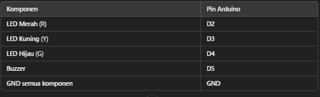
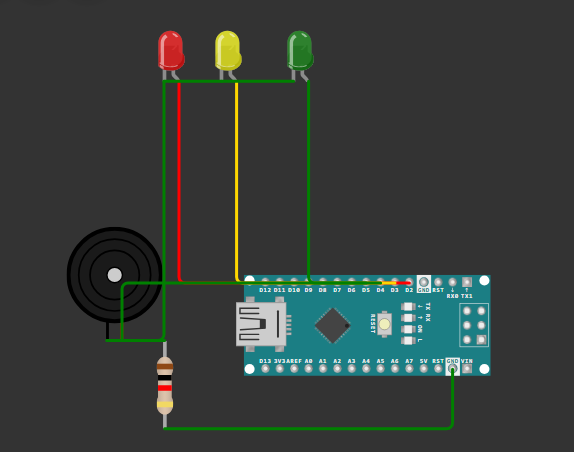

# Lampu lalu lintas
Simulasi lampu lalu lintas menggunakan 3 led, arduino nano dan buzzer.

## Alat dan Bahan
- Arduino Nano
- LED merah (R)
- LED kuning (Y)
- LED hijau (G)
- Buzzer
- Resistor 220Ω (untuk setiap LED)
- Resistor 1kΩ (untuk buzzer jika diperlukan)
- Kabel jumper

## Koneksi 

----
## Sketch 
